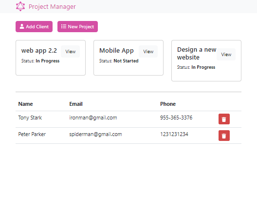

# Project Manager

  

## Description

This is an app I built to practice working with MERN stack technologies- namely graphql for querying a mongoDB database. On the backend, this app makes use of a MongoDB database hosted on MongoDB atlas. To query the database, we are using a node express server to make use of mongoose and graphql. On the front-end we are using React, Bootstrap, and Apollo.

This app has full CRUD functionality!

## Installation and Usage

To run this app locally, clone the repo.

To run the backend server, start in the root folder.
In root:  
```
npm i
npm start
```
You'll need to update the environment variable for the frontend to ensure you're connecting to the local server.  
Open the ```.env ``` file inside the ```./client``` folder. Change the ```APOLLO_URI``` to reflect the address of the graphql endpoint on the node express server. Normally this should be ```http://localhost:5000/graphql```

To run the frontend server, cd into the client folder ```cd client```  
In ./client:  
```
npm i
npm run start
```
The app should now be accessible at ```http://localhost:3000```

## Built With
### Backend


  
[Mongoose] [MongoDB Atlas]

### Frontend


### Languages


### Dev Tools


